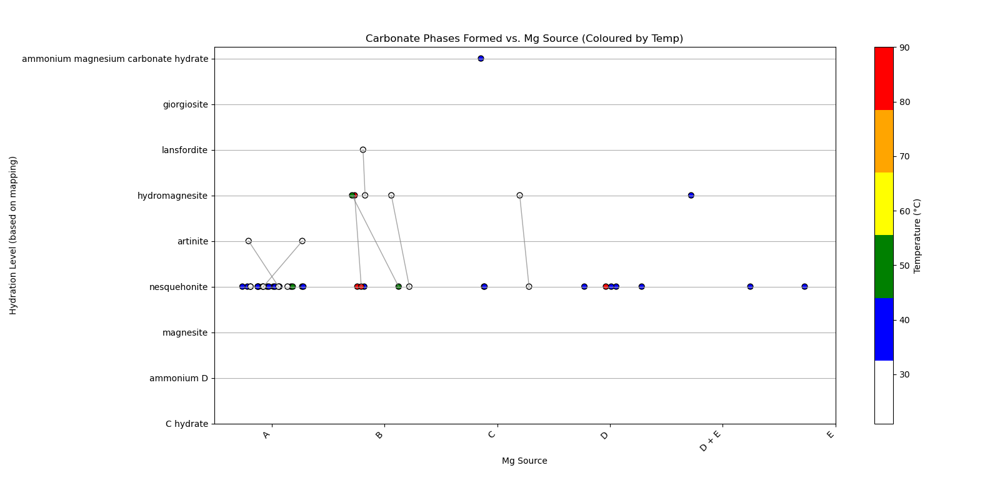

# Mineral-Phases-plot-py 
Included:   
-phasedata-example.csv   
-phasedata-example.xlsx  
-scatter-xrd-phases-linked.py  

This repo contains python scripts for scatter plots of mineralisation data.

If you're a researcher or industrialist running large batches of bulk mineralisation reactions, this will help plot the resultant phases and give 
The data we're plotting is available in .csv and excel formats and is split into 4 columns.  

Assuming the columns and formatting are conserved, these datasheets can be adapted to store and plot the results of any mineralisation experiments.   
Here we choose to use Magnesium sources with the aim of making different magnesium carbonate phases.   

The data we'll be pulling from is arranged in the example files phasedata-example whether in .csv or .xlsx  
Let's look at the first two rows to get an idea. 

### Sample Data Table

| Sample      | Mg_Source | T/°C | Main_Phases           |
|-------------|-----------|------|------------------------|
| 1403/ A     | A         | 23   | Nesq + Artinite        |
| 0904        | A         | 23   | Nesquehonite           |
  
-Sample = name of the sample (arbitrary) 
-Mg_Source = formula/composition of the magnesium source used in the experiment, labelled here as A, B, C, D and E to mask, as yet, unpublished results. In practice these would be MgNO3, Mg(OH)2. 
-T/°C = The temperature at which this reaction was performed 
-Main_Phases = The main phases produced from the reaction, normally confirmed by XRD. If there is more than one phase present in your final product, you can account for this by adding '+'  e.g. Nesquehonite and Artinite produced --> Nesq + Artinite. 

Below is an outline of how the script works and by exntension, how to adapt it for your needs. 

# Using the script 
-Download the scatter-xrd-phases-linked.py   
-Change the path of pd.read_excel("**phasedata-example.xlsx**, engine='openpyxl') to the path of your excel sheet, if using a csv you can change this line to pd.read_csv("your_csv")   
-Run the script with python scatter-xrd-phases-linked.py  else in an IDE like VStudio Code and voila.     

Assuming you've got more than the two columns in your sheet, you can generate a plot like this:    

# How the script works   
The X axis can hold any discrete variable used as a name for the MgSource, as well as cases where two different Mg_Sources are combined as the reactants such as E + D. 
The first two chunks in the script help clean the data of both MgSource and Main_Phases, so that you don't have to pay particular attention when marking down these names in your sheet e.g. Nesq is read as nesquehonite and plotted accordingly   

Because there are several phases of magnesium carbonate, we decided to arrange them by A. whether or not they were magnesium carbonates or simply unreacted Mg_Sources and B. how much water each phase holds, hence the giorgiosite and ammonium magnesium carbonate at the top of the y axis.   

You can arrange the y axis how you like by adjusting the values assigned to each discrete variable/name in hydration mapping:  
    "lansfordite": 6,
    "giorgiosite": 7,  

